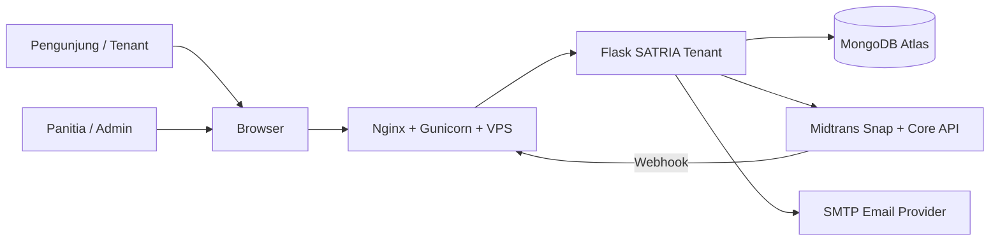

# Master Technical Specification

## SATRIA 2026 Tenant Registration

**Dokumen:** Master Technical Specification  
**Versi:** 1.1  
**Status:** As-is / baseline implementasi  
**Tanggal:** 2026-09-08  
**Bahasa aplikasi:** Bahasa Indonesia

---

## 1. Tujuan dan Ruang Lingkup

SATRIA Tenant adalah aplikasi web untuk pendaftaran tenant atau booth pameran. Sistem menyediakan:

- landing page acara (marketing/summit-style) terpisah dari formulir pendaftaran;
- halaman formulir pendaftaran tenant tersendiri (`/daftar`);
- perhitungan biaya booth dan opsi tambahan;
- pembayaran online melalui Midtrans Snap;
- sinkronisasi status pembayaran melalui webhook dan pengecekan Core API;
- halaman status pendaftaran (dengan pencarian nomor pendaftaran) dan kartu peserta berbasis QR;
- panel admin multi-halaman (sidebar navigation, bukan satu halaman scroll) untuk pengelolaan konten, booth, add-on, pendaftar, email, dan check-in;
- sesi admin dengan auto-logout setelah 5 menit tanpa aktivitas;
- ekspor data pendaftaran ke CSV;
- migrasi satu kali dari SQLite lama ke MongoDB.

Dokumen ini mendeskripsikan arsitektur dan perilaku yang saat ini diimplementasikan, sekaligus menjadi baseline untuk pengembangan, pengujian, deployment, dan operasi.

### 1.1 Di luar ruang lingkup

- pembuatan refund melalui aplikasi; refund dilakukan melalui dashboard Midtrans;
- multi-role admin dan permission granular;
- reservasi kuota berbasis sesi atau keranjang;
- pengiriman email melalui queue/asynchronous worker;
- penyimpanan file pada object storage;
- aplikasi mobile native.

---

## 2. Ringkasan Arsitektur

### 2.1 Diagram konteks



### 2.2 Lapisan aplikasi

| Lapisan | Implementasi | Tanggung jawab |
|---|---|---|
| Web/API | Flask 3.1 | Routing halaman, JSON API, session admin, validasi input |
| Template | Jinja2 | Rendering halaman publik dan admin |
| Frontend | JavaScript vanilla + CSS | Form registrasi, Snap.js, status pembayaran, carousel, scanner QR |
| Domain model | MongoEngine | Dokumen MongoDB, relasi, computed properties, snapshot harga |
| Database | MongoDB Atlas | Data transaksi, konten, akun admin, broadcast |
| Payment | `midtransclient` | Pembuatan transaksi, status Core API, validasi signature webhook |
| Notification | SMTP | Email pendaftaran, bukti pembayaran, broadcast |
| Web server | Gunicorn di belakang Nginx | Serving produksi, reverse proxy, HTTPS termination |

### 2.3 Struktur source utama

```text
app.py                     Routing, validasi, workflow, admin
models.py                  Dokumen MongoEngine dan business properties
midtrans_service.py        Adapter Midtrans Snap/Core API
email_service.py           Adapter SMTP dan template email
migrate_to_mongo.py        Migrasi SQLite ke MongoDB
templates/index.html       Landing page acara
templates/register.html    Formulir pendaftaran tenant (/daftar)
templates/status.html      Status pendaftaran
templates/ticket.html      Kartu peserta
templates/admin/_layout.html   Layout admin bersama (header + sidebar)
templates/admin/*.html     Satu halaman per area admin (lihat 6.4)
static/js/                 Interaksi browser
static/css/                Styling
static/img/                Aset statis (logo)
static/uploads/            File gambar lokal runtime
deploy/                    Nginx dan systemd unit
```

---

## 3. Aktor dan Hak Akses

| Aktor | Akses |
|---|---|
| Pengunjung | Melihat informasi acara, melihat booth aktif, membuat pendaftaran, melakukan pembayaran, melihat status dengan `order_id`, melihat tiket jika lunas |
| Admin terautentikasi | Semua fungsi publik, dashboard multi-halaman, CRUD booth/add-on/konten/pembicara/foto, mengubah status tenant, broadcast email, ekspor CSV, scan dan reset check-in |
| Midtrans | Membuat transaksi dan mengirim notifikasi status pembayaran |
| SMTP provider | Mengirim email notifikasi dan broadcast |

Semua route `/admin/*` dilindungi decorator `admin_required`, yang memeriksa `session["admin_id"]` dan otomatis menghapus sesi setelah 5 menit tanpa aktivitas (lihat 9.1).

---

## 4. Alur Bisnis Utama

### 4.1 Registrasi dan pembayaran

1. Pengunjung membuka `GET /` (landing page acara) lalu masuk ke `GET /daftar` (formulir pendaftaran), baik lewat tombol CTA maupun tautan "Pilih booth" yang membawa parameter `?booth=<id>` untuk pra-pilih jenis booth.
2. Sistem menampilkan booth aktif, sisa kuota, dan add-on aktif pada formulir.
3. Browser mengirim data JSON ke `POST /api/register`.
4. Backend memvalidasi field wajib, panjang field, email, booth aktif, kuota, add-on, dan deskripsi.
5. Backend membuat `Tenant` dengan status `pending` dan menyimpan snapshot harga booth serta add-on.
6. Backend membuat transaksi Midtrans Snap dengan total booth + add-on.
7. Backend menyimpan `snap_token` dan `midtrans_order_id`.
8. Browser membuka Snap.js.
9. Status pembayaran diperbarui melalui webhook Midtrans. Browser juga dapat meminta konfirmasi melalui Core API.
10. Saat status berubah menjadi `paid`, sistem membuat `checkin_token`, mengunci kuota secara logis, dan mengirim email bukti pembayaran.

### 4.2 Pembayaran dilanjutkan

- Untuk tenant `pending`, `POST /api/pay/<order_id>` mengembalikan token lama bila tersedia.
- Bila token lama tidak ada, sistem membuat `midtrans_order_id` baru.
- `Tenant.order_id` tidak berubah karena menjadi alamat tetap halaman status.
- Status `expired`, `cancelled`, atau `failed` tidak dapat dilanjutkan dan harus melakukan pendaftaran ulang.

### 4.3 Status pembayaran

| Status internal | Kondisi Midtrans |
|---|---|
| `pending` | `capture` dengan fraud challenge/tidak accept atau status lain yang belum final |
| `paid` | `settlement` atau `capture` + `fraud_status=accept` |
| `cancelled` | `cancel` atau `deny` |
| `expired` | `expire` |
| `failed` | `failure` |
| `refunded` | `refund` atau `partial_refund` |

### 4.4 Check-in

1. Tenant lunas membuka `/ticket/<order_id>`.
2. QR berisi `checkin_token` acak, bukan `order_id`.
3. Admin membuka `/admin/scan` dan memberi izin kamera browser.
4. Browser membaca QR menggunakan jsQR.
5. Backend memvalidasi token, status lunas, dan status check-in sebelumnya.
6. Check-in pertama menyimpan `checked_in_at`; scan berikutnya mengembalikan status `repeat`.
7. Admin dapat membatalkan check-in dari halaman daftar kehadiran terakhir.

### 4.5 Kuota

```text
slots_taken = jumlah Tenant dengan payment_status = "paid"
slots_remaining = max(quota - slots_taken, 0)
```

Pendaftaran `pending` tidak mengurangi kuota. Ini berarti beberapa pengunjung dapat memulai pembayaran untuk slot yang sama sebelum salah satunya menjadi lunas. Implementasi produksi yang membutuhkan reservasi saat checkout perlu menambahkan mekanisme hold dan expiry atomik.

---

## 5. Spesifikasi Data

Database default adalah MongoDB dengan koleksi berikut.

### 5.1 `booth_types`

| Field | Tipe | Aturan |
|---|---|---|
| `name` | string | wajib, maksimum 100 |
| `description` | string | opsional |
| `price` | integer | Rupiah tanpa desimal, non-negatif pada form admin |
| `quota` | integer | non-negatif pada form admin |
| `is_active` | boolean | menentukan apakah tampil di publik |
| `sort_order` | integer | urutan tampil |
| `created_at` | datetime | otomatis |

### 5.2 `add_ons`

Memiliki pola yang sama dengan `BoothType`: `name`, `description`, `price`, `is_active`, `sort_order`, dan `created_at`. Add-on aktif dapat dipilih saat registrasi.

### 5.3 `tenants`

| Field | Tipe | Aturan / fungsi |
|---|---|---|
| `order_id` | string | wajib, unik, format `SATRIA26-<10 hex uppercase>` |
| `institution_name` | string | wajib, maksimum 200 |
| `pic_name` | string | wajib, maksimum 150 |
| `email` | string | wajib, maksimum 150, validasi format dasar |
| `phone` | string | wajib, maksimum 30 |
| `booth_type` | reference | wajib ke `BoothType` |
| `price_at_registration` | integer | snapshot harga booth |
| `description` | string | maksimum 2.000 karakter |
| `payment_status` | string | `pending`, `paid`, `expired`, `cancelled`, `failed`, `refunded` |
| `midtrans_transaction_id` | string | ID transaksi Midtrans |
| `midtrans_order_id` | string | order ID transaksi Midtrans terakhir; di-index |
| `payment_type` | string | bank transfer, QRIS, e-wallet, dan lain-lain |
| `paid_at` | datetime | waktu menjadi lunas |
| `snap_token` | string | token Snap aktif |
| `selected_add_ons` | embedded list | nama dan harga snapshot setiap add-on |
| `checkin_token` | string | token QR unik; sparse unique index |
| `checked_in_at` | datetime | waktu check-in pertama |
| `created_at` / `updated_at` | datetime | audit waktu dokumen |

`total_amount` dihitung sebagai `price_at_registration + addon_total` dan tidak mengambil harga terkini dari katalog.

### 5.4 Konten dan administrasi

- `admin_users`: `username` unik dan `password_hash`.
- `event_info`: satu dokumen untuk venue, tanggal, maps, hero (eyebrow, judul, lead, video), subjudul, intro (judul/isi), judul bagian pembicara, dan catatan acara.
- `gallery_photos`: nama file, caption, urutan, aktif/nonaktif, mode gambar, posisi x/y.
- `speakers`: nama, institusi, topik, foto, urutan, aktif/nonaktif, posisi x/y.
- `broadcasts`: subject, body, audience, jumlah penerima/terkirim/gagal, waktu dibuat.
- `highlight_items`: sorotan acara pada landing page - judul, deskripsi, gambar opsional, urutan, aktif/nonaktif.
- `agenda_items`: satu baris jadwal pada timeline acara - label waktu, aktivitas, urutan.
- `reason_items`: alasan bergabung sebagai tenant - judul, deskripsi, urutan.
- `keynote_sections`: satu dokumen singleton untuk judul dan isi sesi keynote pada landing page.

### 5.5 Seed default

Saat startup, `seed_defaults()` membuat data awal jika koleksi kosong:

- dua jenis booth contoh;
- satu `EventInfo` contoh;
- satu admin `admin` dengan password awal yang wajib diganti;
- dua add-on contoh.

---

## 6. Kontrak HTTP

### 6.1 Route publik

| Method | Path | Fungsi |
|---|---|---|
| `GET` | `/` | Landing page acara (marketing, agenda, booth, alasan hadir) |
| `GET` | `/daftar` | Formulir pendaftaran tenant, terpisah dari landing page |
| `POST` | `/api/register` | Membuat tenant dan transaksi Midtrans |
| `GET` | `/status/<order_id>` | Status pendaftaran; refresh status pending |
| `POST` | `/api/pay/<order_id>` | Membuka atau membuat ulang pembayaran pending |
| `POST` | `/api/payment/<order_id>/confirm` | Mengambil status terbaru dan mengembalikan `{paid: boolean}` |
| `GET` | `/ticket/<order_id>` | Kartu peserta untuk tenant lunas |
| `GET` | `/ticket/<order_id>/qr.svg` | SVG QR token check-in |
| `POST` | `/webhook/midtrans` | Notifikasi status dari Midtrans |

### 6.2 Payload `POST /api/register`

```json
{
  "institution_name": "Nama institusi",
  "pic_name": "Nama PIC",
  "email": "pic@example.com",
  "phone": "08123456789",
  "booth_type_id": "ObjectId string",
  "description": "Produk yang dipamerkan",
  "add_on_ids": ["ObjectId string"]
}
```

Respons sukses:

```json
{
  "order_id": "SATRIA26-ABCDEF1234",
  "snap_token": "...",
  "redirect_url": "..."
}
```

Respons error memakai bentuk `{ "error": "..." }` dengan HTTP 400 untuk input, 502 untuk kegagalan pembuatan transaksi, 404 untuk resource yang tidak ditemukan, dan 403 untuk signature webhook tidak valid.

### 6.3 Webhook Midtrans

Field minimum yang diwajibkan:

```text
order_id, status_code, gross_amount, signature_key, transaction_status
```

Signature diverifikasi dengan:

```text
SHA512(order_id + status_code + gross_amount + MIDTRANS_SERVER_KEY)
```

Webhook idempotent terhadap email lunas: email hanya dikirim ketika transisi pertama ke `paid`.

### 6.4 Route admin

Sejak versi 1.1, dashboard admin bukan lagi satu halaman panjang dengan anchor scroll,
melainkan satu halaman `GET` per area, semuanya memakai layout bersama
(`templates/admin/_layout.html`) dengan sidebar navigasi tetap.

**Halaman (GET, dilindungi `admin_required`):**

| Area | Path | Template |
|---|---|---|
| Ringkasan | `/admin` | `admin/ringkasan.html` |
| Sambutan (hero) | `/admin/hero` | `admin/hero.html` |
| Lokasi | `/admin/lokasi` | `admin/lokasi.html` |
| Konten summit | `/admin/summit` | `admin/summit.html` |
| Foto | `/admin/foto` | `admin/foto.html` |
| Pembicara | `/admin/pembicara` | `admin/pembicara.html` |
| Booth | `/admin/booth` | `admin/booth.html` |
| Tambahan | `/admin/tambahan` | `admin/tambahan.html` |
| Kirim email | `/admin/email` | `admin/email.html` |
| Pendaftaran | `/admin/pendaftaran` | `admin/pendaftaran.html` |
| Akun | `/admin/akun` | `admin/akun.html` |
| Pindai QR | `/admin/scan` | `admin/scan.html` |

**Aksi (POST, mutasi data):**

| Area | Endpoint |
|---|---|
| Auth | `GET/POST /admin/login`, `GET /admin/logout`, `GET /admin/idle-logout` |
| Ekspor | `GET /admin/tenants/export.csv` |
| Scan | `POST /admin/scan/verify`, `POST /admin/scan/reset/<tenant_id>` |
| Booth | `POST /admin/booth/new`, `POST /admin/booth/<booth_id>/update` |
| Add-on | `POST /admin/addon/new`, `POST /admin/addon/<addon_id>/update` |
| Event | `POST /admin/event` (dipakai bersama oleh form hero, lokasi, summit, pembicara - hanya field yang dikirim yang diperbarui) |
| Keynote | `POST /admin/keynote` |
| Sorotan acara | `POST /admin/highlight/new`, `POST /admin/highlight/<highlight_id>/update`, `POST /admin/highlight/<highlight_id>/delete` |
| Agenda | `POST /admin/agenda/new`, `POST /admin/agenda/<agenda_id>/update`, `POST /admin/agenda/<agenda_id>/delete` |
| Alasan hadir | `POST /admin/reason/new`, `POST /admin/reason/<reason_id>/update`, `POST /admin/reason/<reason_id>/delete` |
| Foto | `POST /admin/photo/upload`, update, delete |
| Pembicara | `POST /admin/speaker/new`, update, delete |
| Broadcast | `POST /admin/broadcast` |
| Akun | `POST /admin/password` |
| Tenant | update status dan delete melalui `/admin/tenant/<tenant_id>/...` |

Setiap aksi mutasi mengarahkan kembali (redirect) ke halaman area terkait, bukan ke `/admin`.

Semua endpoint admin menggunakan form POST kecuali endpoint scan yang menerima JSON.

---

## 7. Integrasi Eksternal

### 7.1 Midtrans

- Snap.js client dimuat dari sandbox atau production berdasarkan `MIDTRANS_IS_PRODUCTION`.
- Server membuat transaksi menggunakan server key.
- Server memvalidasi webhook menggunakan server key, bukan client key.
- URL webhook produksi: `https://<domain>/webhook/midtrans`.
- `gross_amount` harus sama dengan jumlah item booth dan add-on.

### 7.2 SMTP

Konfigurasi minimal `SMTP_USER` dan `SMTP_PASS`. Jika tidak ada, fungsi email mengembalikan `False` dan proses bisnis utama tetap berjalan.

Email yang tersedia:

1. pendaftaran diterima;
2. pembayaran lunas;
3. broadcast admin ke semua, paid, pending, atau pilihan manual.

Kegagalan email dicatat melalui logger dan tidak menggagalkan registrasi atau webhook.

---

## 8. Konfigurasi Environment

| Variable | Wajib | Keterangan |
|---|---|---|
| `MONGODB_URI` | Ya | Connection string MongoDB Atlas |
| `SECRET_KEY` | Ya produksi | Kunci signing session Flask; wajib acak dan rahasia |
| `MIDTRANS_SERVER_KEY` | Ya pembayaran | Server key sandbox/production |
| `MIDTRANS_CLIENT_KEY` | Ya frontend pembayaran | Client key yang sesuai mode |
| `MIDTRANS_IS_PRODUCTION` | Ya pembayaran | `true` atau `false` |
| `SMTP_HOST` | Opsional | Default `smtp.gmail.com` |
| `SMTP_PORT` | Opsional | Default `587` |
| `SMTP_USER` | Opsional | Mengaktifkan email jika bersama password |
| `SMTP_PASS` | Opsional | Gunakan app password bila Gmail |
| `SMTP_FROM_NAME` | Opsional | Default `Panitia SATRIA 2026` |

`.env` tidak boleh di-commit atau ditampilkan pada log.

---

## 9. Keamanan dan Validasi

### 9.1 Kontrol yang sudah ada

- password admin disimpan sebagai hash Werkzeug;
- validasi signature webhook SHA-512;
- `checkin_token` acak dan tidak diturunkan dari nomor pendaftaran;
- validasi ObjectId untuk resource dan add-on;
- batas upload aplikasi 5 MB;
- ekstensi gambar dibatasi JPG, JPEG, PNG, WEBP, GIF;
- nama file upload diganti dengan token acak;
- output template memakai escaping Jinja default;
- status ticket hanya tersedia untuk tenant lunas;
- QR response memakai `Cache-Control: no-store`;
- sesi admin otomatis berakhir setelah 5 menit tanpa aktivitas (dicek di server lewat `admin_required`, dan didorong dari sisi klien lewat `admin-idle.js`), lalu diarahkan ke halaman utama;
- Nginx disiapkan sebagai reverse proxy dan HTTPS perlu diaktifkan.

### 9.2 Risiko dan hardening yang direkomendasikan

Prioritas tinggi sebelum publikasi:

1. Tambahkan CSRF protection untuk seluruh form admin dan endpoint mutasi berbasis session.
2. Tambahkan rate limiting pada login, registrasi, resume payment, confirm payment, dan scan verify.
3. Ganti password admin default dan `SECRET_KEY`.
4. Jangan mengembalikan exception Midtrans mentah ke pengguna; gunakan pesan generik dan simpan detail pada log.
5. Tambahkan validasi MIME/content image, bukan hanya ekstensi file.
6. Pastikan `.env`, `static/uploads`, dan backup database tidak terekspos publik.
7. Tambahkan header keamanan HTTP: HSTS, CSP, `X-Content-Type-Options`, `Referrer-Policy`, dan frame protection.
8. Sanitasi output dari `scan.js`; saat ini detail hasil scan dibangun dengan `innerHTML` dari data server.
9. Pertimbangkan kontrol akses terpisah untuk admin operasional, editor konten, dan finance.

---

## 10. Deployment dan Operasi

### 10.1 Lokal

```bash
python3 -m venv venv
# Linux/macOS: source venv/bin/activate
# Windows: venv\Scripts\activate
pip install -r requirements.txt
copy .env.example .env
python app.py
```

Default lokal: `http://localhost:5000`.

### 10.2 Produksi

1. Sediakan VPS, Python virtualenv, MongoDB Atlas, domain, dan sertifikat TLS.
2. Isi `.env` dengan kredensial production.
3. Jalankan Gunicorn pada `127.0.0.1:8000`.
4. Letakkan Nginx di depan Gunicorn.
5. Sajikan `/static/` langsung melalui Nginx.
6. Daftarkan webhook Midtrans pada domain HTTPS.
7. Aktifkan systemd unit dan restart policy.
8. Verifikasi log aplikasi, webhook, SMTP, dan koneksi MongoDB.

Konfigurasi baseline saat ini:

- Nginx `client_max_body_size`: 6 MB;
- aplikasi `MAX_CONTENT_LENGTH`: 5 MB;
- Gunicorn contoh: 3 worker, bind `127.0.0.1:8000`;
- upload gambar disimpan di `static/uploads` pada disk server.

### 10.3 Backup dan recovery

Minimum operational requirement:

- backup MongoDB terjadwal dan uji restore;
- backup folder `static/uploads` karena metadata file berada di MongoDB tetapi file fisik berada di disk;
- simpan kredensial di secret manager atau permission file yang ketat;
- catat waktu deployment, perubahan environment, dan status webhook.

---

## 11. Migrasi Data

`migrate_to_mongo.py` membaca `satria.db` dan menyalin tabel lama ke koleksi MongoDB. Proses mencakup booth, add-on, relasi add-on tenant, tenant, admin, event info, gallery, speaker, dan broadcast.

Prosedur:

1. buat backup `satria.db`;
2. siapkan `MONGODB_URI` yang benar;
3. jalankan migrasi pada database kosong;
4. verifikasi jumlah dokumen dan beberapa data sampel;
5. verifikasi file gambar lama tersedia pada `static/uploads`;
6. jangan menjalankan ulang pada database yang sudah berisi data tanpa strategi deduplikasi.

Catatan: script migrasi saat ini dapat membuat duplikasi jika dijalankan ulang pada database yang sama. Migrasi idempotent atau dry-run sebaiknya ditambahkan untuk operasi produksi.

---

## 12. Observability dan Audit

### 12.1 Log yang perlu tersedia

- startup dan kegagalan koneksi MongoDB;
- request webhook: order ID, status, hasil verifikasi, tanpa server key;
- kegagalan pembuatan transaksi Midtrans;
- kegagalan email dan jumlah broadcast sukses/gagal;
- login gagal dan perubahan password;
- perubahan status tenant oleh admin;
- check-in dan reset check-in.

### 12.2 Audit gap saat ini

Model belum memiliki audit log terpisah untuk perubahan admin. Perubahan status, harga, kuota, konten, delete tenant, dan reset check-in sebaiknya dicatat dalam koleksi audit dengan actor, action, target, before/after, timestamp, dan IP.

---

## 13. Kebutuhan Pengujian Penerimaan

### 13.1 Registrasi

- validasi field wajib dan format email;
- booth tidak aktif atau penuh ditolak;
- add-on duplikat, invalid, atau nonaktif ditolak;
- total Midtrans sama dengan harga booth + snapshot add-on;
- kegagalan Midtrans tidak menghasilkan respons sukses;
- email gagal tidak membatalkan pendaftaran.

### 13.2 Pembayaran

- sandbox success menghasilkan `paid`, `paid_at`, dan `checkin_token`;
- webhook dengan signature salah menghasilkan 403;
- webhook duplikat tidak mengirim email lunas dua kali;
- status expire/cancel/failure mengosongkan Snap token;
- pembayaran ulang memakai Midtrans order ID baru tetapi URL status tetap;
- pembayaran refund menjadi `refunded`.

### 13.3 Admin dan check-in

- route admin mengarahkan pengguna anonim ke login;
- password lama wajib benar untuk perubahan password;
- status manual `paid` membuat tiket dan mengirim bukti lunas;
- QR valid pertama menjadi `ok`, scan kedua menjadi `repeat`;
- QR invalid dan tenant belum lunas ditolak;
- reset check-in menghapus waktu hadir;
- export CSV memuat snapshot harga, status, paid time, dan check-in time.

### 13.4 Deployment

- aplikasi dapat start dengan environment valid;
- aplikasi gagal secara eksplisit bila `MONGODB_URI` kosong;
- Nginx meneruskan header host/proto dengan benar;
- webhook dapat diakses melalui HTTPS publik;
- upload 5 MB diterima dan upload di atas batas ditolak;
- restore database dan file upload berhasil pada lingkungan staging.

---

## 14. Backlog Teknis Prioritas

### P0 - sebelum production

- CSRF protection dan rate limiting;
- secret rotation, password admin default, dan HTTPS;
- logging webhook serta error yang terstruktur;
- backup MongoDB dan `static/uploads`;
- validasi image content dan hardening header HTTP;
- uji end-to-end Midtrans sandbox.

### P1 - stabilitas dan skala

- mekanisme reservasi/hold kuota atomik;
- background job untuk email broadcast;
- object storage untuk upload;
- audit log admin;
- pagination dan filter dashboard tenant;
- unique/index strategy untuk query yang bertambah besar.

### P2 - maintainability

- pisahkan route, service, dan repository dari `app.py`;
- tambah test suite otomatis untuk model, API, webhook, dan permission;
- tambah schema validation terpusat;
- migrasi idempotent dengan dry-run dan laporan rekonsiliasi;
- observability metrics untuk pembayaran, email, dan check-in.

---

## 15. Definition of Done Produksi

Sistem dapat dinyatakan siap produksi jika:

- seluruh environment production tervalidasi;
- pembayaran sandbox dan production telah diuji dengan webhook publik;
- status pembayaran tidak bergantung hanya pada callback browser;
- admin default telah diganti dan semua secret aman;
- HTTPS, CSRF, rate limit, dan backup aktif;
- proses restore telah diuji;
- data kuota, pembayaran, email, tiket, dan check-in memiliki test penerimaan;
- runbook insiden tersedia untuk webhook gagal, pembayaran tidak sinkron, email gagal, dan kehilangan file upload.
